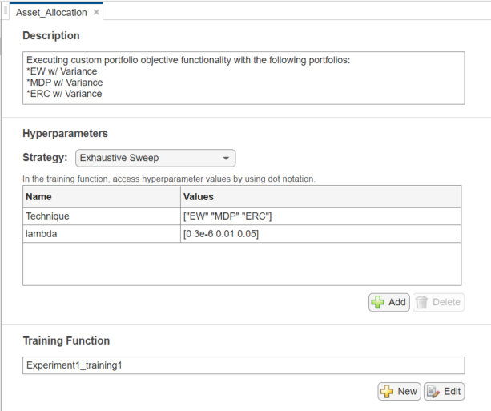
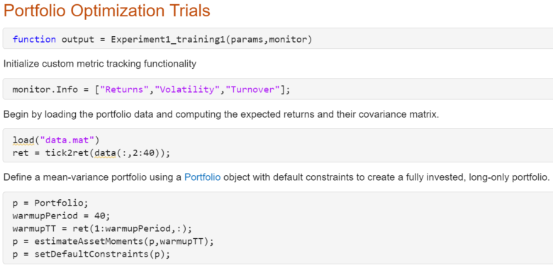
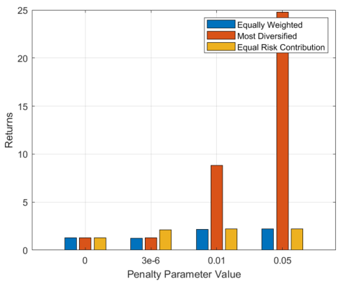
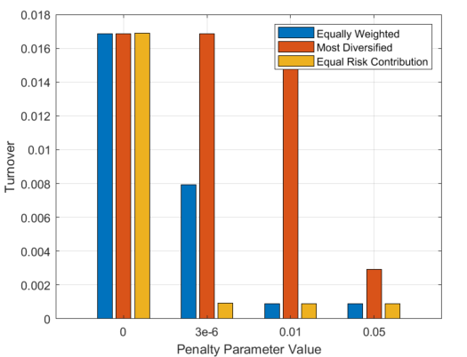

## Managing Asset Allocation with the Experiment Manager

## Overview
For the workflow of portfolio optimization, it can be challenging to meet the portfolio optimization criteria when several objectives exist. Using the Experiment Manager, a portfolio manager or quant can easily assess the experiments and outcomes and select the best scenario that meets their criteria.

The Experiment Manager is a MATLAB® app that allows the user to sweep through several combinations
of hyperparameters, or scenarios, for deep learning experiments. It has since been expanded to 
accomodate what are known as custom training experiments, which allow the user to execute experiments
that do not include deep learning functionality. For a custom training experiment, the user also
has the ability to specify outputs that the app monitors with each iteration of the experiment. This
demonstration is intended to give you a starting point while developing your own workflow.

Often times, users will try to develop their own program to execute experiments and store the results.
Another approach might be to run each experiment individually and manually record the results and
corresponding parameters into a spreadsheet or notepad. However, approaches such as these can easily
lead to confusion about which tests were run, how scenarios were defined and experiments/results
were recorded, and other concerns. The Experiment Manager provides a user interface to easily
set up and execute experiments, while recording and reporting the corresponding results in one place.

In this example, a custom training experiment was developed to fine tune portfolio optimization parameters.
Two hyperparameters are varied, which are the penalty parameter, or lambda, and the objective function, or
Technique. Three outputs are then monitored to assess the performance of each iteration, including Returns,
Volatility, and Turnover. Upon running the example, the app outputs the table shown below.

## Getting Started
Download or clone this repository to your machine and open it in MATLAB.

## Setup
To run:
1. Open CustomPortfolio_Expr.prj
2. Open the Experiment Manager app by typing experimentManager into the Command Window
3. If prompted to open the current project by the Experiment Manager app, select Yes.
4. Double click on Asset_Allocation under the Experiment Browser
5. Press the "Run" button on the top tool strip

Requires:
* Deep Learning Toolbox™ if using MATLAB 2020a, 2020b, 2021a, 2021b, 2022a, 2022b, 2023a
	* Note: Deep Learning Toolbox is not required if using MATLAB 2023b or later versions
* Financial Toolbox™

## Portfolio Optimization and Backtesting
Fundamental knowledge of portfolio theory and backtesting is assumed. If you need a refresher,
please see the following links for more information:

[Portfolio theory](https://corporatefinanceinstitute.com/resources/capital-markets/modern-portfolio-theory-mpt/)
Portfolio backtesting: https://www.refinitiv.com/en/asset-management-solutions/portfolio-management/backtest-your-portfolio-performance

This demo specifically uses MATLAB's Portfolio object in conjunction with user-defined custom objectives.

In this example, we specifically investigate equally weighted, most-diversified portfolio, and equal
risk contribution objectives, each with a penalty parameter. More information about each of the objective
functions can be found at the following link:
https://www.mathworks.com/help/finance/diversify-portfolio-using-custom-objective-function.html#DiversiPortfoliosUseEstimateCustomObjectivePortfolioExample-3

## Experiment Manager for Asset Allocation
Portfolio optimization can be used in conjunction with the Experiment Manager by first defining a training function and
hyperparameters to the app. The two hyperparameters for this example, lambda (the penalty parameter) and Technique
(the objective function), are specified under the "Hyperparameters" section in the image below.

Additionally, the user must specify a training function for a custom experiment like this one under the "Training Function" section.
This function serves as the blueprint for setting up the experiments. A snippet of the training function for this example is shown
below.

The training function in this demonstration, in addition to loading the portfolio data and initializing the portfolio
object, defines the custom metrics that we want the app to record while executing each experiment in line 2. The user
specifies the hyperparameters, and ergo scenarios, through the "params" variable. This variable is then called and 
used to define scenarios in the image below.

The hyperparameters in the function are specified in lines 11 and line 18.

## Case Study
The data used in this study was simulated using geometric Brownian motion and consists of 39 simulated stocks. This
study cycles through the three diversification techniques described above, in addition to four different penalty
parameter values. The Experiment Manager app drawsup the results in a table, which can be exported directly to the
MATLAB workspace. The user can then generate plots and draw inferences on the effects of the various permutations
of the metrics upon the following outputted parameters: returns, volatility, and turnover.

## Results
Three bar plots below were created to compare the results of each diversification strategy and penalty parameter combination. 

Returns vs. Penalty Parameter

Volatility vs. Penalty Parameter

Turnover vs. Penalty Parameter

We can see that each monitored parameter responded differently, dramatically so in some instances, when the penalty
parameter was changed. When evaluating the first plot, we recognize that the returns increase with an increase in the
penalty parameter. Volatility also increases with the penalty parameter value, while the Turnover is overall reduced.
The most diversified portfolio objective technique is an interesting scenario, where returns demonstrate a dramatic
increase with the penalty parameter without reducing the turnover as dramatically as the other two objectives under
investigation.

The question of which Technique and lambda combination to select for your portfolio can vary in this instance, depending
on how much risk the PM is willing to take on for the returns. Personally, I would steer clear of the most diversified
portfolio, as the turnover and volatility are both high with the penalty parameter. If the PM is willing to take on
slightly more risk for higher returns, the equal risk contribution objective is recommended when the penalty parameters is
either 3e-6 or 0.01. Conversely, if the PM is comfortable with slightly lower returns in exchange for reduced risk, the
equally weighted scheme when the penalty parameter is 3e-6 or 0.01 is recommended.

## Conclusion
The goal of this example was to show:
* What the Experiment Manager App is
* How the App can be applied to explore the impact of portfolio optimization parameters
* Build a foundation for finance professionals to explore their own portfolio or other financial experiments

Feel free to contact me if you are interested in updates.

## License
The license is available in the License.txt file in this GitHub repository.

## Contact
Sara Galante at sdavis@mathworks.com

Copyright 2024 The MathWorks, Inc.
